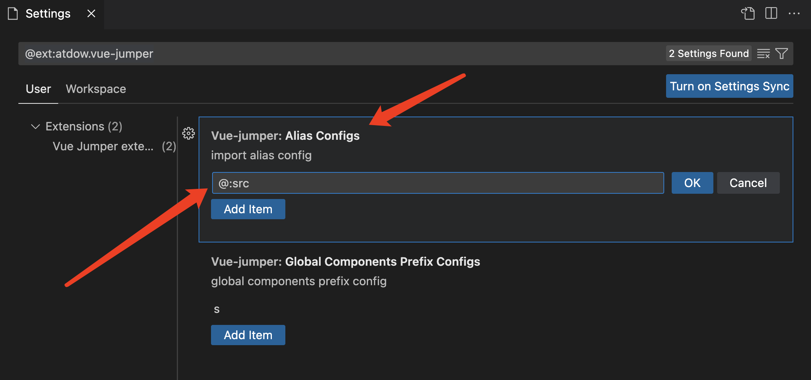
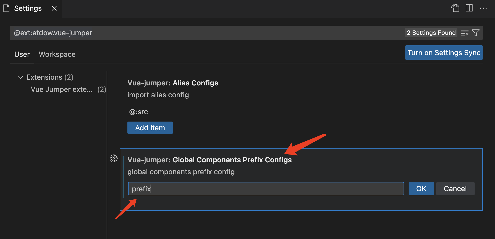

<!--
 * @Author: atdow
 * @Date: 2022-11-01 21:07:59
 * @LastEditors: null
 * @LastEditTime: 2022-11-07 21:55:29
 * @Description: file description
-->

# vscode-vue-jumper

vue文件跳转到文件定义支持。


## 1. 支持标签跳转

支持大驼峰组件、中划线组件。

```html
<my-component></my-component>
<MyComponent></MyComponent>
```

## 2. 支持import相对路径文件跳转

```js
import MyComponent form '../../component/MyComponent'
import MyComponent2 form '../../component/MyComponent2.vue'
```

## 3. 支持import别名路径文件跳转

import别名路径就是在vue.config.js，也就是在webpack中配置了 `alias` 别名

```js
// vue.config.js
export default {
    chainWebpack: config => {
        config.resolve.alias.set('@$', resolve('src'))
    }
}
```

```js
import MyComponent form '@/component/MyComponent'
```

默认配置了 `@:src` (格式： `别名名称:目标路径` ) ，如果有需要，请到插件配置中设置 `aliasConfigs` ：



## 4. 支持mixins引入组件注册跳转

```html
<template>
    <div>
        <MyComponent />
    </div>
</template>

<script>
    import mixins from "./mixins";
    export default {
        mixins: [mixins],
        props: {},
        data() {
            return {};
        },
        components: {},
    };
</script>
```

```js
// mixins.js
import MyComponent from "./modules/MyComponent";
export default {
    data() {
        return {}
    },
    components: {
        MyComponent
    }
}
```

## 5. 全局组件注册前缀配置

如果全局组件注册的组件是带前缀的(比如公司前缀)，并且组件源码的文件名是不带前缀的，那么我们需要在插件的 `globalComponentsPrefixConfigs` 配置中加入前缀配置：



项目组件注册情况：

```js
// main.js
import PrefixMyComponent from './components/MyComponent'
vue.use(PrefixMyComponent) // 组件注册
```

```js
// components/MyComponent/index.js
import MyComponent from './src/index.vue';

/* istanbul ignore next */
MyComponent.install = function(Vue) {
    Vue.component(MyComponent.name, MyComponent);
};

export default MyComponent;
```

```html
<!-- components/MyComponent/src/index.vue -->
<template>
    <div>MyComponent</div>
</template>

<script>
    export default {
        name: 'PrefixMyComponent',
    }
</script>
```

```html
<!-- 使用 -->
<template>
    <prefix-my-component>MyComponent</prefix-my-component>
</template>

<script>
    export default {
        name: 'PrefixMyComponent',
    }
</script>
```

## 版本

* 2.2.0 修复windows兼容问题
* 2.1.0 增加全局注册带特殊前缀组件跳转支持
* 2.0.0 增加mixins引入组件注册跳转支持
* 1.3.0-1.5.0 修复匹配错误
* 1.2.0 增加组件重命名跳转
* 1.1.0 支持多workspaceFolders工作区跳转
* 1.0.0 支持基础跳转
