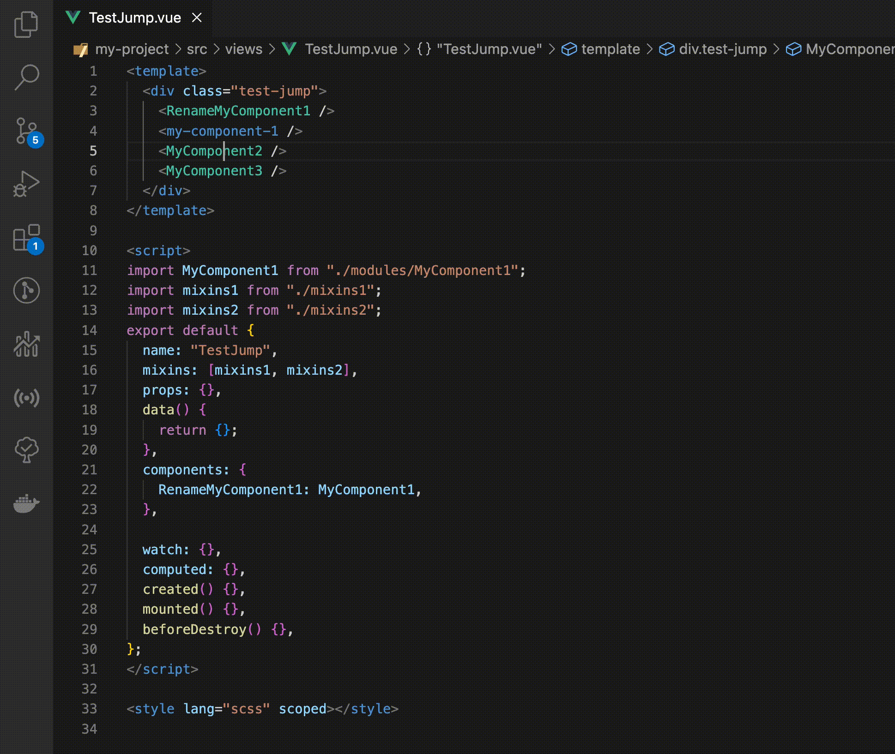

<!--
 * @Author: atdow
 * @Date: 2022-11-01 21:07:59
 * @LastEditors: null
 * @LastEditTime: 2022-11-05 01:37:33
 * @Description: file description
-->

# vscode-vue-jumper

vue文件跳转到文件定义支持。



## 1. 标签跳转支持

支持大驼峰组件、中划线组件。

```html
<my-component></my-component>
<MyComponent></MyComponent>
```

## 2. import相对路径文件跳转支持

```js
import MyComponent form '../../component/MyComponent'
import MyComponent2 form '../../component/MyComponent2.vue'
```

## 3. import别名路径文件跳转支持

```js
import MyComponent form '@/component/MyComponent'
```

默认配置了 `@:src` ，如果有需要，请到插件配置中设置aliasConfigs：

格式： `别名名称:目标路径`

## 4. mixins引入组件注册跳转支持

```html
<template>
    <div>
        <MyComponent />
    </div>
</template>

<script>
    import mixins from "./mixins";
    export default {
        mixins: [mixins],
        props: {},
        data() {
            return {};
        },
        components: {},
    };
</script>
```

```js
// mixins.js
import MyComponent from "./modules/MyComponent";
export default {
    data() {
        return {}
    },
    components: {
        MyComponent
    }
}
```

## 版本

* 2.0.0 增加mixins引入组件注册跳转支持
* 1.3.0-1.5.0 修复匹配错误
* 1.2.0 增加组件重命名跳转
* 1.1.0 支持多workspaceFolders工作区跳转
* 1.0.0 支持基础跳转
