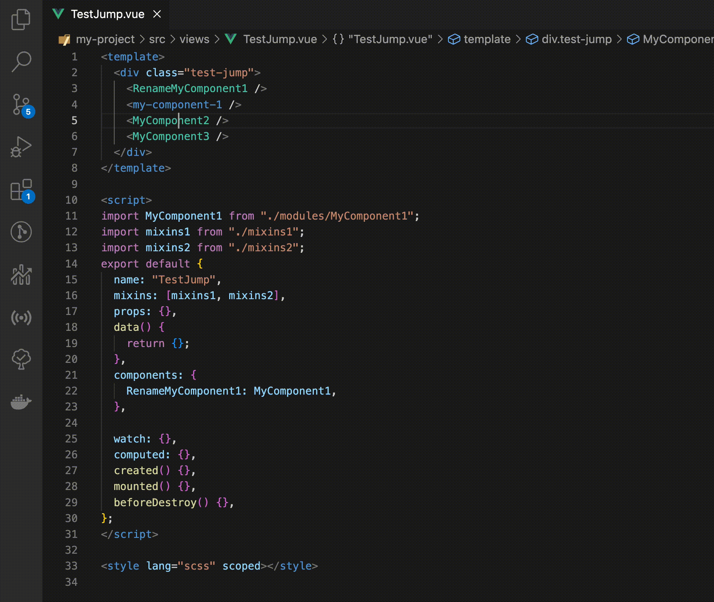
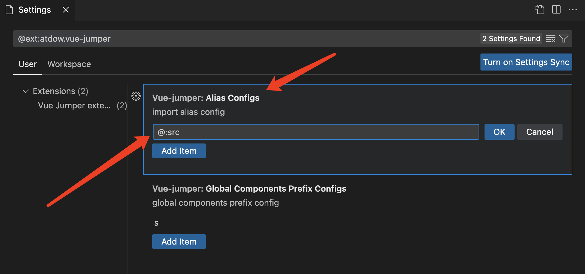
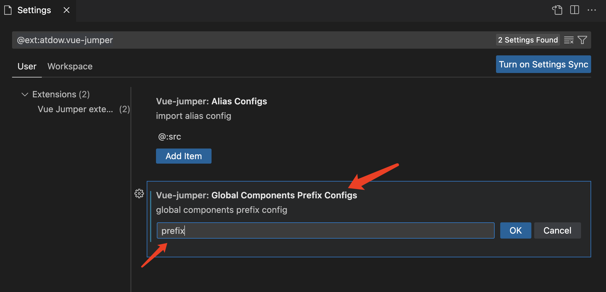

<!--
 * @Author: atdow
 * @Date: 2022-11-01 21:07:59
 * @LastEditors: null
 * @LastEditTime: 2023-11-14 20:55:36
 * @Description: file description
-->

# vscode-vue-jumper

vue 文件跳转到文件定义支持。



## 1. 支持标签跳转

支持大驼峰组件、中划线组件。

```html
<my-component></my-component> <MyComponent></MyComponent>
```

## 2. 支持 import 相对路径文件跳转

```js
import MyComponent form '../../component/MyComponent'
import MyComponent2 form '../../component/MyComponent2.vue'
```

## 3. 支持 import 别名路径文件跳转

import 别名路径就是在 vue.config.js，也就是在 webpack 中配置了 `alias` 别名

```js
// vue.config.js
export default {
  chainWebpack: (config) => {
    config.resolve.alias.set('@$', resolve('src'))
  }
}
```

```js
import MyComponent form '@/component/MyComponent'
```

默认配置了 `@:src` (格式： `别名名称:目标路径` ) ，如果有需要，请到插件配置中设置 `aliasConfigs` ：



## 4. 支持 mixins 引入组件注册跳转

```html
<template>
  <div>
    <MyComponent />
  </div>
</template>

<script>
  import mixins from './mixins'
  export default {
    mixins: [mixins],
    props: {},
    data() {
      return {}
    },
    components: {}
  }
</script>
```

```js
// mixins.js
import MyComponent from './modules/MyComponent'
export default {
  data() {
    return {}
  },
  components: {
    MyComponent
  }
}
```

## 5. 全局组件注册前缀配置

如果全局组件注册的组件是带前缀的(比如公司前缀)，并且组件源码的文件名是不带前缀的，那么我们需要在插件的 `globalComponentsPrefixConfigs` 配置中加入前缀配置：



项目组件注册情况：

```js
// main.js
import PrefixMyComponent from './components/MyComponent'
vue.use(PrefixMyComponent) // 组件注册
```

```js
// components/MyComponent/index.js
import MyComponent from './src/index.vue'

/* istanbul ignore next */
MyComponent.install = function (Vue) {
  Vue.component(MyComponent.name, MyComponent)
}

export default MyComponent
```

```html
<!-- components/MyComponent/src/index.vue -->
<template>
  <div>MyComponent</div>
</template>

<script>
  export default {
    name: 'PrefixMyComponent'
  }
</script>
```

```html
<!-- 使用 -->
<template>
  <prefix-my-component>MyComponent</prefix-my-component>
</template>

<script>
  export default {
    name: 'PrefixMyComponent'
  }
</script>
```

## 6. 组件跳转与文档配置

通过 `rules` 配置可以自定义组件的查找规则和文档链接。每条规则可以包含组件前缀匹配、文件查找模式和文档地址：

```json
"vue-jumper.rules": [
  {
    "prefix": "uni-",
    "docUrl": "https://uniapp.dcloud.net.cn/component/uniui/{name}.html", // hover 时出现的文档地址
    "searchPattern": {
      "include": "**/node_modules/@dcloudio/uni-ui/lib/*/$1",
      "exclude": ""
    }
  },
  {
    "prefix": "u-",
    "docUrl": "https://uviewui.com/components/{name}.html",
    "searchPattern": {
      "include": "**/node_modules/uview-ui/components/$1",
      "exclude": ""
    }
  },
  // 默认配置，应放在最后
  {
    "prefix": "*",
    "searchPattern": {
      "include": "**/$1",
      "exclude": "**/{node_modules,build,dist}"
    }
  }
]
```

配置说明：

- `prefix`: 组件前缀，`*` 表示匹配所有未匹配的组件
- `docUrl`: 组件文档地址，支持 `{name}` 变量替换
- `searchPattern`: 文件查找模式
  - `include`: 匹配包含的文件路径
  - `exclude`: 匹配排除的文件路径

规则匹配按配置顺序进行，未匹配到特定前缀的组件将使用 `prefix: "*"` 的默认规则。

## 版本

- 2.5.0 新增跳转 tsx 组件支持
- 2.4.0 兼容其他写法匹配
- 2.3.0 修复匹配错误
- 2.2.0 修复 windows 兼容问题
- 2.1.0 新增全局注册带特殊前缀组件跳转支持
- 2.0.0 新增 mixins 引入组件注册跳转支持
- 1.3.0-1.5.0 修复匹配错误
- 1.2.0 增加组件重命名跳转
- 1.1.0 支持多 workspaceFolders 工作区跳转
- 1.0.0 支持基础跳转
